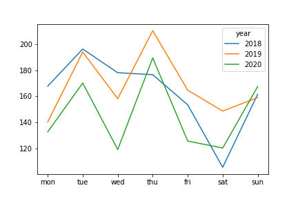
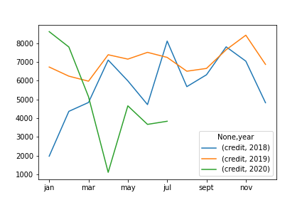

## EFTPOS Transaction analysis

Looking at how transactions volume changed going through COVID lockdowns.  
Also, predicting transaction volums for operations optimisation.  
For example, does rain reduce foot traffic? Then maybe few employees need to be rostered on days with high chance of rain.

## Data analysis process

**Loading**  
Loaded Ofx transaction format from Commbank. However, Commbank would not provide Ofx formatted file for start-mid of 2018 due to extraction limitations. Instead I had to scrape the PDF statement and perform some manual changes to be able to append to the dataframe. Going forward this should not be an issue as the the Ofx format cant used. 

**Cleaning**
Cleaning and formatting columns.  
Duplicated transaction to be either depit of credit instead of being entered by date. 

**Analysis**  
Panda operations to analysise the information.
**Futher Analysis to follow...!**

## Summary results

